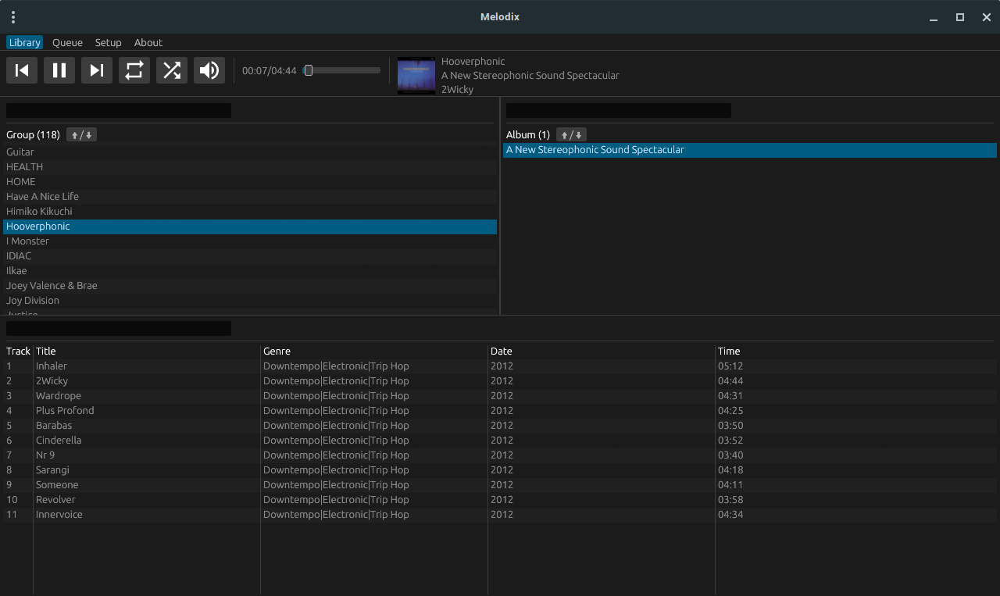

# Melodix
A simple music player, written in Rust.

## Usage
Download the latest release from [here](https://github.com/luxreduxdelux/melodix/releases) and launch Melodix.

Move the content inside of `script` into your Melodix installation's own `script` folder to install last.fm and Discord support.

(You can easily access it by going to `Setup` in Melodix, then `Script`, then `Open Folder`.)

## Documentation
The Lua module API documentation can be found [here](https://github.com/luxreduxdelux/melodix/blob/main/src/lua/meta.lua).

## Build
On Linux (Debian/Ubuntu/Mint):

`sudo apt install libgtk-3-dev libxdo-dev libayatana-appindicator3-dev`

Run `cargo build --release` in the root of the Melodix folder.

## Acknowledgement
[agus-balles](https://github.com/agus-balles) for additional help.

## License
Melodix has a BSD-2-Clause-Patent license.