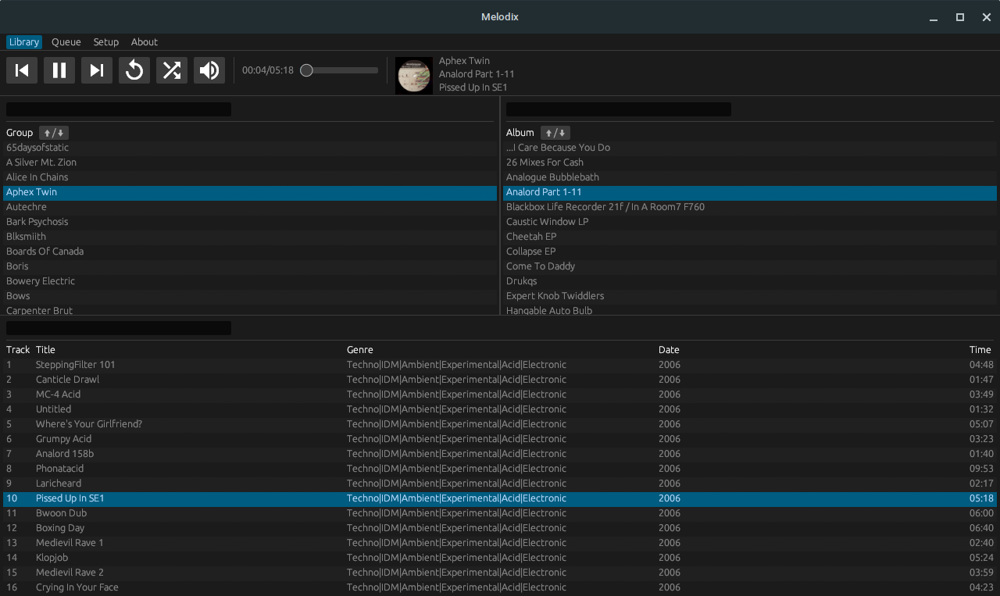
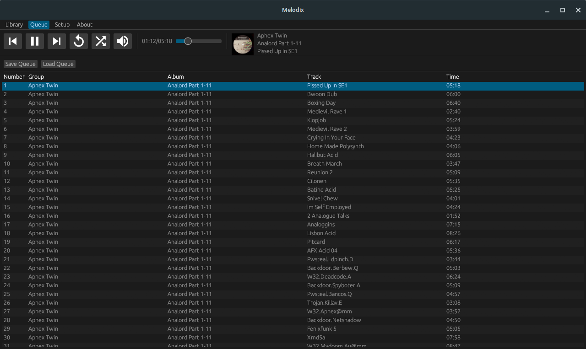

# Melodix
A simple music player, written in Rust.

  
  

## Usage
Download the latest release from [here](https://github.com/luxreduxdelux/melodix/releases) and launch Melodix.

## Documentation
The Lua module API documentation can be found [here](https://github.com/luxreduxdelux/melodix/blob/main/src/lua/meta.lua).

## Build
Run `cargo build --release` in the root of the Melodix folder.

Alternatively, download [Boondle](https://github.com/luxreduxdelux/boondle) and open the `boondle` folder to compile and package a .deb/.AppImage from source.

## Acknowledgement
[agus-balles](https://github.com/agus-balles) for additional help.

## License
Melodix has a BSD-2-Clause-Patent license.